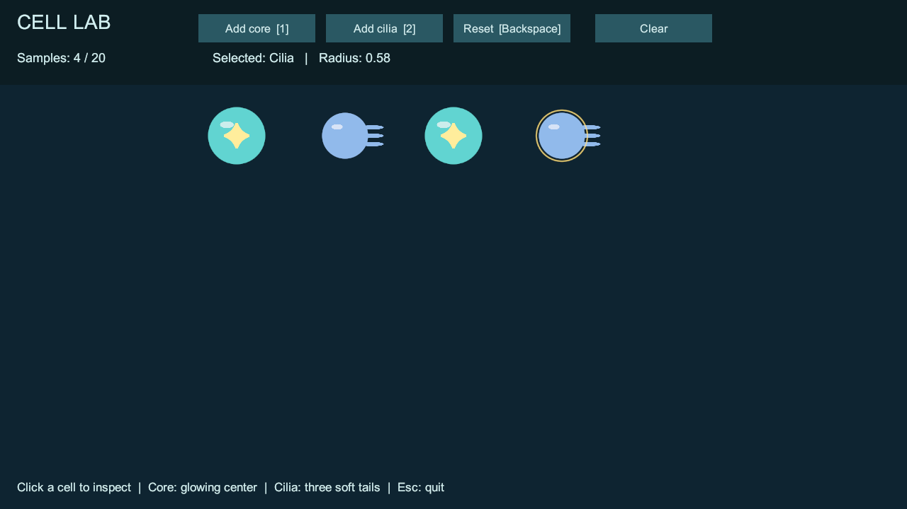

# T01：基础细胞与实验室

日期：2026-10-02｜结果：已完成。

## 实现与使用

打开 `Assets/_Emerge/Scenes/CellLab.unity`，进入 Play。初始生成一颗核心和一颗纤毛。

| 操作 | 行为 |
| --- | --- |
| Add core / 1 | 添加核心样本 |
| Add cilia / 2 | 添加纤毛样本 |
| 点击细胞 | 显示选中描边、类型与半径；点击空白取消选择 |
| Reset / Backspace | 删除现有样本与选择状态，恢复初始两颗 |
| Clear | 清空全部样本 |
| Esc（独立程序） | 正常退出 |

当前容量为 20，达到上限后添加按钮禁用。样本按固定位置排列，便于观察；它们还没有物理、连接或控制线路。实验室允许多个核心用于展示，不代表正式游戏允许多核心共生体。

数据在 `Assets/_Emerge/Data/Cells/Core.asset` 与 `Cilia.asset` 中，可调整类型、名称、半径与主体颜色。预制体在 `Prefabs/Cells`，圆形、星点与选中描边是生成的占位资源。最终美术与动画留到后续阶段。

## 实测结果

- Unity 编译与 Windows 开发包构建：Succeeded，0 错误、0 警告。
- 独立程序初始样本为核心和纤毛。
- 调用实际按钮事件后，两种样本数量正确增加。
- 选择状态可以切换。
- 连续重置三次后仍为初始两颗；下一帧层级中也仅保留两颗，旧对象已销毁。
- 清空后数量为零、选择为空。
- 超额生成被限制在容量内，添加按钮正确禁用。
- 独立程序完成检查后正常退出，退出码 0。
- 离屏渲染预览在 1280×720 下确认细胞、功能特征、选中圈与界面文字可见。

证据：`Logs/t01-build.log`、`Logs/build-report.txt`、`Logs/t01-player.log` 中的 `CELL_LAB_T01_PASS`。日志和构建包为本地文件，不提交到 GitHub；下图保留为可查看证据。



## 验证边界

自动检查调用按钮事件与选择接口，验证组件接线和状态生命周期；不等同于真实鼠标点击或键盘输入的端到端测试。快捷键和鼠标手感需要用户在 Play 模式体验，VS Code 实际断点命中也仍待验证。

预览为 Unity 相机离屏渲染，UI 临时切换为相机空间用于截图；日常运行仍使用屏幕覆盖 UI。第一次隐藏窗口截图全黑，未将其作为画面通过证据。

## 重复运行检查

关闭 Unity 后重新构建开发包，运行：

```powershell
.\Builds\Windows\Emerge.exe --cell-lab-smoke --cell-lab-screenshot "E:\gamejam\gamejam_1\emerge\Logs\cell-lab-t01.png" -logFile "E:\gamejam\gamejam_1\emerge\Logs\t01-player.log"
```

检查入口只包含于编辑器 / Development Build，普通发布构建不包含自动验证代码。代码会在指定模式启用后台运行，并在结束后退出。

下一项为 T02：拖拽、旋转、编辑模式与移动边界约束。
