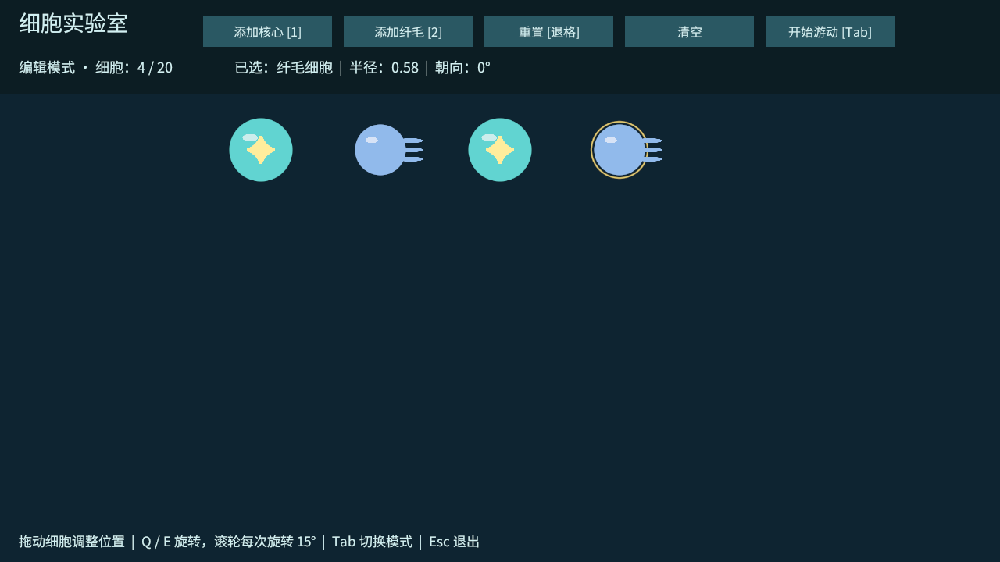

# T02：中文界面与细胞编辑

日期：2026-10-02。T01 的两种细胞显示已由用户在 Unity 中确认可用。

## 本次行为

- 游戏内标题、按钮、模式、细胞名称、属性和提示使用中文；中文字体随包分发。
- 编辑模式：鼠标左键选择并拖拽，保持抓取位置偏移；松开结束，失焦取消拖拽；主体限制在可视操作区域。
- Q 逆时针 / E 顺时针连续旋转，每秒 90°；滚轮每次旋转 15°。
- Tab 或顶部按钮切换编辑 / 游动。游动模式可选择查看，但禁止拖拽、旋转、添加、重置和清空；切换立即取消拖拽并保留位置与朝向。
- 编辑阶段 E 用于旋转；后续同化动作需要按模式区分，不可与编辑旋转同时触发。

## 验证

Windows 开发包构建成功，0 错误、0 警告。独立程序通过 `--cell-lab-smoke` 检查：生成与选择、抓取偏移、松开后停止移动、越界限制、旋转、拖拽中切换模式、游动下修改锁定、返回编辑保留布局、中文字符串与字体字形覆盖、重复重置、清空、数量上限和对象清理。日志 `Logs/t02-player.log` 输出 `CELL_LAB_T02_PASS`，正常退出码 0。

1280×720 离屏预览检查中文排版、细胞与按钮显示：

自动检查调用与真实输入共同使用的操作方法和按钮回调；真实鼠标拖拽、Q/E、滚轮、Tab、失焦与不同窗口比例仍需人工体验。开发包离屏渲染退出时日志有 Unity / URP 的 ComputeBuffer 回收与原生分配诊断；没有业务异常，退出码为 0，不能据此宣称运行日志完全无警告。

## 当前边界

本阶段没有 Rigidbody2D、关节、推力或连接。游动模式锁定编辑，尚不能实际游动；因此本次验证的是切换不改变布局、不允许拖拽推进。真实物理下无异常冲量需在 T03 / T04 接入物理后复查。暂允许细胞重叠，防重叠与连接约束属于 T03。

美术替换不需改拖拽与旋转逻辑，详见 [美术资产替换指南](美术资产替换指南.md)。下一项：T03 自由圆周连接与图结构。
