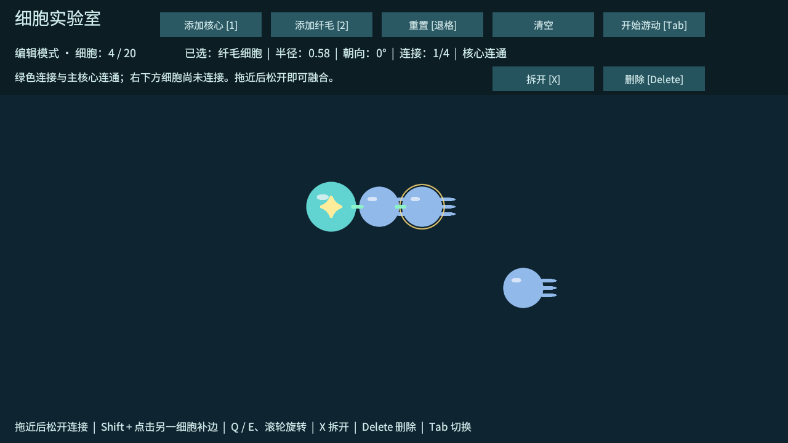

# T03：圆周连接与身体图结构

日期：2026-10-02。

## 操作与规则

- 编辑模式中，将一个细胞或已连接身体拖近其他细胞，松开时在圆周上吸附并创建一条连接。吸附范围为两个半径之和以外约 0.45 个世界单位，接触角度连续，不使用固定六向接口。
- 已连接细胞整体拖动，保持原有位置关系。移动或吸附导致与其他细胞重叠、超出操作区域时会被阻止，并显示中文原因。
- 先选中一个细胞，再按住 Shift 点击另一个已接触的细胞，可补一条边形成环。距离不足、重叠、自己连接自己、重复边或达到数量上限会被拒绝。
- 核心连接上限为 6，纤毛为 4，保存在 CellDefinition 数据中。配置脚本当前采用这两个原型初值。
- X /「拆开」移除所选细胞的全部连接；Delete /「删除」移除细胞和关联边。拆开后仍可移动碎片并重新连接。
- 第一个核心是主核心。只有沿连接图可到达主核心的细胞具备核心控制资格；绿色桥表示核心连通，灰色桥表示脱离核心。选中信息显示连接数和控制状态。
- 实验室允许多个核心样本；其他核心不会单独向碎片发出控制。删除主核心后若仍有核心样本，按创建顺序选第一个作为新的主核心；没有核心时全部失去控制资格。这是实验室规则，正式开局身体仍按单核心设计。
- 游动模式禁止连接、拆开、删除和布局修改。切换、失焦或清空取消拖拽，不触发意外吸附。

## 实现边界

图结构保存无向边，用带访问集合的遍历判定连通，环路不会无限遍历。显示由独立连接视图负责，使用工程材质引用，保证打包时着色器被保留。

本阶段连接是编辑拓扑与视觉桥，尚未创建 Rigidbody2D 或物理关节，也没有信号或推力。核心控制资格已经可查询，真正失去信号 / 推进的行为需在 T04 / T06 接入时复查。软角度吸附尚未加入；当前提供自由角度与距离吸附。正式融合膜的美术属于后续表现阶段。

## 验证方式

在独立 Windows 开发包中，以 `--cell-lab-smoke` 执行同一运行时操作方法：连续角度吸附、整组拖动、重叠 / 自连接 / 重复边 / 距离 / 连接上限拒绝、链、三角环、环内替代路径、删除桥接细胞后的失控、删除唯一核心、游动模式拓扑锁定，以及清空 / 重置后图和对象清理。同时回归 T01 / T02 的生成、选中、旋转、拖拽、模式切换、中文字体与数量上限。

实测 Windows 构建成功，0 错误、0 警告；独立程序输出 `CELL_LAB_T03_GRAPH_PASS` 和 `CELL_LAB_T03_PASS`，正常退出码 0；1280×720 连接显示预览检查通过。构建和运行结果以 `Logs/t03-build.log`、`Logs/build-report.txt` 与 `Logs/t03-player.log` 为准。自动检查直接调用输入共用方法和按钮回调，真实鼠标拖拽 / Shift 点击仍需在 Unity 中人工体验。

下一项：T04 基础输入订阅、物理连接与纤毛反作用力；随后 T05 做多刚体稳定性决策。
