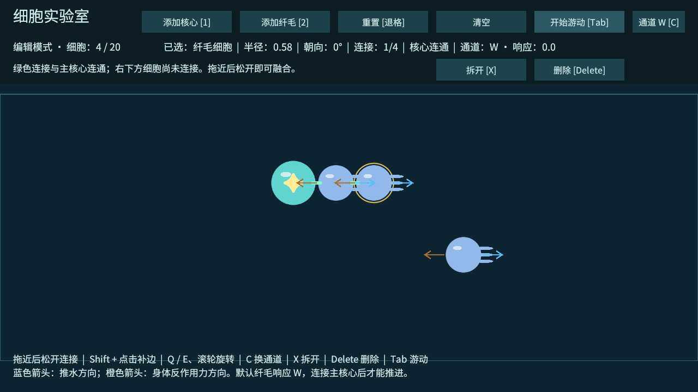

# T04：四通道输入、物理连接与纤毛反作用力

日期：2026-10-02。

## 操作

1. 在 CellLab 的编辑模式中，把纤毛拖近主核心并松开连接。
2. 选中纤毛，用 Q / E 或滚轮旋转。蓝箭头表示局部 +X 的推水方向，橙箭头表示相反的身体受力方向。
3. 按 C 或右上通道按钮，在 W → A → S → D 间选择这个纤毛响应的键。默认 W。
4. 按 Tab 开始游动，再按住对应键。连接的核心和细胞通过真实物理关节受力移动；松键停止施力，已有速度按阻尼逐渐降低。
5. Tab 返回编辑会暂停所有细胞物理、清零线速度和角速度、保留真实物理位置而非回退插值位置、移除旧关节。可继续改布局、朝向和通道，再次游动时以新布局重建关节。

WASD 是四个独立通道，不等同世界上下左右。例如默认纤毛尾巴朝右，W 激活时身体向左受力；把纤毛旋转 180° 后，同一个 W 会使身体向右受力。

## 实现

- 每个 CellView 初始化一个动态 Rigidbody2D 和圆形 CircleCollider2D。碰撞半径来自细胞数据，零重力；核心质量 1.4，纤毛质量 1，纤毛推力 3.5，线阻尼 1.2，角阻尼 2。
- 每条身体边在游动时对应一个 FixedJoint2D，锚点为圆周接触点，频率 8 Hz，阻尼比 1。相邻细胞不互相碰撞，其他细胞和实验室边界正常碰撞。
- 显式加载并克隆 `Data/EmergeControls.inputactions`，订阅四个 Intent 动作的 performed / canceled；关闭时禁用，销毁时取消订阅。失焦取消输入，恢复后支持读取仍按住的键。
- FixedUpdate 中只对与主核心连通的纤毛施加 `AddForceAtPosition`。位置偏离整体质心会经关节产生转矩，不使用 WASD 直接改坐标。
- 每个纤毛暂时绑定一个通道，强度限制在 0～1；多键不会叠加到同一纤毛。沿连接自动判定核心连通是 T04 临时驱动方案。每条边的线路标记、衰减、多个响应通道和最强路径传播在 T06 接入。
- 蓝 / 橙箭头和实验室边界为独立占位显示，可继续替换美术。实验室墙用碰撞约束身体，防止测试时游出视野。

## 验证证据

Windows 开发包构建通过，0 错误、0 警告。独立包正常退出码 0，日志输出 `CELL_LAB_T04_PHYSICS_PASS` 与 `CELL_LAB_T04_PASS`。具体文件为 `Logs/t04-build.log`、`Logs/build-report.txt`、`Logs/t04-player.log`。

测试向临时 Input System Keyboard 注入键状态事件，经过真实 InputAction 订阅和 FixedUpdate，再读取 Rigidbody2D 的位置、速度与角度；不是直接调用测试用推力接口。

| 对照 | 观察结果 |
| --- | --- |
| 两细胞沿 X 排列，纤毛转 180°，W 持续 20 个固定步 | 核心 X 位移约 +0.104；受力方向为 +X；没有明显意外转矩 |
| 纤毛位于核心上方，保持向右受力，W 持续 25 个固定步 | 核心产生约 -10.22° 的转动，位置偏置产生真实转矩 |
| 纤毛在核心上方转到 90°，W 持续 20 个固定步 | 核心 Y 位移约 -0.104；朝向改变了实际运动方向 |
| 改绑定为 A，再按 W / A | W 不激活；A 推进；WASD 同时按下强度仍为 1 |
| 释放按键 | 推力归零，已有速度按阻尼降低 |
| 纤毛未连接核心 | 即使按 W，也没有控制响应和自主推力 |
| 无输入切换模式 5 次 | 编辑时无旧关节；游动时一条边只对应一个关节，无初始冲量 |
| 编辑模式持续输入、拆开后重新游动 | 编辑位置不变；拆开后不重建旧物理关节 |

同时回归 T01～T03 的生成、选择、拖拽、旋转、中文、连接拒绝、链 / 环与清理。截图检查 1280×720 中文布局、方向箭头、通道按钮和边界显示：

开发包离屏渲染退出时仍有此前记录的 Unity / URP ComputeBuffer 回收诊断，没有业务异常。测试使用的 IgnoreFocus 和临时键盘仅存在于 `--cell-lab-smoke` 检查，结束后恢复，普通游玩不注入输入。

## 当前限制与下一项

这些是基础双细胞物理与输入对照，不能替代 20～30 节点长链、环、对称身体的持续压力测试。物理方案保留 / 切换仍由 T05 决定；真实收缩尚未实现。没有能量成本、摄食、线路衰减或完整游戏地图。真实键盘手感、窗口失焦、边界碰撞和不同窗口比例仍需人工体验。

下一项：T05 多刚体压力测试与物理方案决策。
