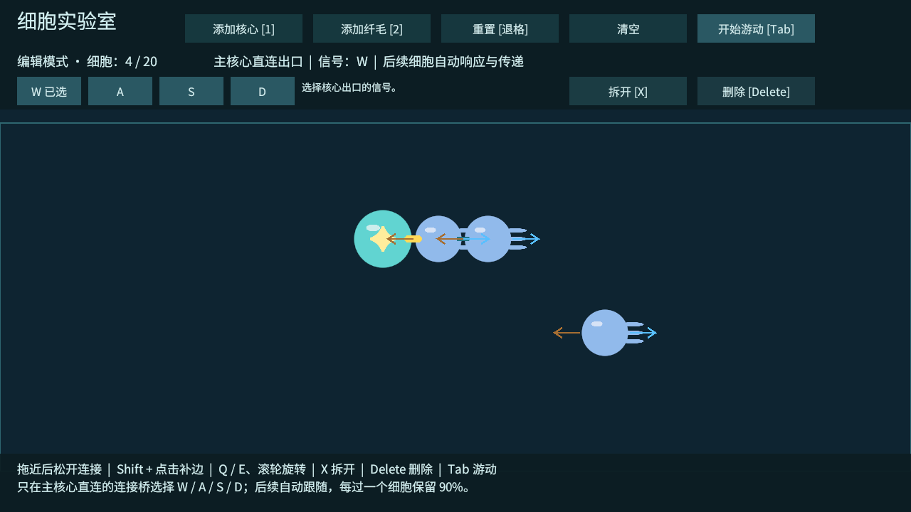

# T06 修正：核心出口配置信号，后续自动跟随

2026-10-02。按用户确认的规则修正 T06：只有与主核心直连的连接可以选择 W/A/S/D；后续连接和纤毛自动接收、响应、转发，不单独配置通道或连接效率。此前的全连接配置属于旧实现，见 [历史记录](T06-验证记录.md)。

## 当前规则与使用

1. 编辑模式将纤毛拖到核心旁边，建立连接；继续连接纤毛即可形成分支。
2. 点击核心与第一个细胞之间的连接桥，在顶部四个按钮中选择一个信号，默认 W。
3. 后续连接只显示自动继承的信号，不显示配置按钮。纤毛只显示朝向与当前响应，没有自己的 WASD 设置。
4. 按 Tab 游动，再按该出口选择的键，整个可达分支自动响应。纤毛沿既有朝向推水，施加相反的身体受力；按键不会修改其朝向。

主核心输出强度为 1。每进入一个普通细胞自动保留 90%，所以第一层为 0.9，第二层为 0.81；不存在玩家设置每条连接损耗的操作。节点保留率属于开发数据，未来传导细胞可另设数值。

不同出口可以分别选 W、A、S、D。未在下游互连的分支独立响应，信号不能返回主核心再串入其他出口。若玩家在下游连接两个分支，原信号可以经过此连接继续传递；该组织可能同时收到两个通道，执行器取最强有效强度，不求和。多条路径也取最强，不通过环路放大。

游动中禁止修改出口通道。拆除桥接连接或删除主核心后更新传播关系；释放输入后停止施力，已有惯性继续由物理阻尼衰减。当前仍以主核心为唯一玩家信号源，其他核心样本不额外注入信号；构筑与出口设置尚无存档。

## 实测

Windows 开发包构建成功，0 错误、0 警告；独立功能检查退出码 0。通过 Input System 测试键盘 / 鼠标验证实际动作订阅和连接桥选择，配置按钮回调、实际刚体施力与基础编辑回归均通过。尚未将自动检查等同于真人操作手感验收。

| 测试 | 结果 |
| --- | --- |
| 三细胞链，仅配置核心出口 | 第一层 0.9，第二层自动跟随为 0.81 |
| 出口分别改为 W/A/S/D | 对应键驱动远端纤毛，其他单键不驱动；实际力为推力 × 0.81 |
| 点击后续连接或纤毛 | 不出现通道配置；调用编辑接口也不会改变出口 |
| 游动时点击出口通道按钮 | 配置保持不变 |
| 四个独立出口、每条两层纤毛 | 单键只激活对应分支；其他分支为 0，四键同时按下各远端仍为 0.81 |
| 四节点环的两个出口选 W 与 A | W 可绕下游到达 A 分支（0.729），A 也可绕到 W 分支；不会返回核心 |
| 单出口连接下游三角闭环，保留率临时为 1 | 强度维持 1，传播终止且不放大；结束后恢复原数据 |
| 松键、拆桥、删除信号源 | 输出归零，传播缓存更新，无悬空选择 |
| 稳定结构刷新 100 次 | 传播关系不反复重建 |

20 / 30 细胞的长链、环、对称体六组规模回归全部通过，共 402 秒模拟时间、20,100 个物理步；T05 的阈值和刚性连接、32 / 16 次求解迭代保持不变。模拟为加速固定步测试，不代表实际帧率或真人试玩时长。

证据：[功能日志](验证数据/T06-核心出口功能验证.txt)、[构建报告](验证数据/T06-核心出口构建报告.txt)、[规模 JSON](验证数据/T06-核心出口规模回归.json)、[规模 CSV](验证数据/T06-核心出口规模回归.csv)。运行退出时仍有 Unity ComputeBuffer 释放警告，与既有记录一致。

开发包仍通过 `--cell-lab-smoke` 执行功能检查，通过 `--cell-lab-stress` 执行规模检查。下一项仍是 T07：构筑反馈与 M1 综合验收。
