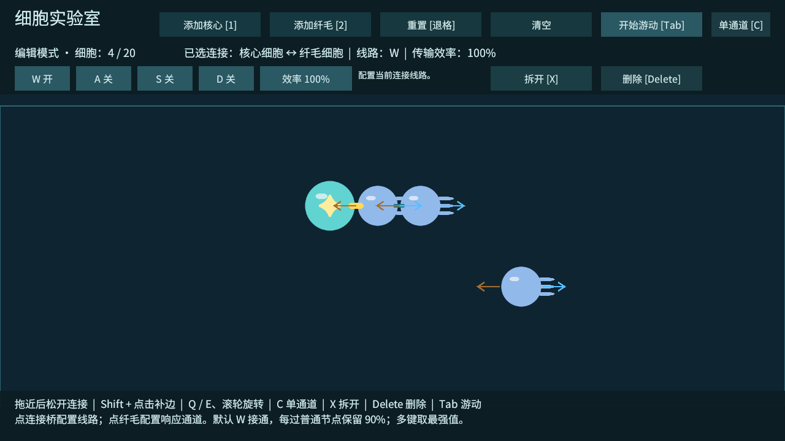

# T06：四通道线路、衰减与执行器响应

2026-10-02，Unity 6000.4.7f1。Windows 开发包构建成功，0 错误、0 警告（[构建报告](验证数据/T06-构建报告.txt)）；功能验证正常退出码 0，接入信号后的六组规模回归也全部通过。

## 操作与规则

- 编辑模式点击两个细胞接触处的连接桥，顶部显示此连接的 W/A/S/D 开关。默认只开 W；机械相连不代表其他通道接通。
- 点击效率按钮循环 100% → 75% → 50%。这是该连接的传输效率，独立于机械关节。
- 点击纤毛，以四个按钮设置允许响应的通道；可多选或全部关闭。C 快捷键改为单通道并循环 W/A/S/D。
- Tab 进入游动，W/A/S/D 只代表输入通道，施力方向仍由纤毛朝向决定。游动中可查看，不能修改线路或响应配置。
- 选中连接按 X 只拆这一条；选中细胞按 X 拆该细胞的全部连接。重置 / 清空会丢弃本次构筑与线路，尚无身体存档。

主核心是唯一玩家信号源，输入强度在 0～1。每条启用线路传输时乘以连接效率和接收节点的 `signalRetention`；普通核心 / 纤毛当前保留 90%。一跳为 0.9，两跳为 0.81；若第二条连接效率 75%，则两跳为 0.6075。

各通道取最强可达路径，路径不求和。执行器再对允许响应的通道取最大强度，四键一起按不会超过单个最强信号。环路包括无衰减环路均会终止，不会无限传播或放大。输入释放、线路关闭、桥接移除或信号源删除后，后续物理步不再施力；已有惯性仍由物理阻尼消散。

传播关系在结构或线路改变时刷新；稳定结构下复用缓存，每个物理步仅计算当前输入对应的执行器强度。能量供给限制和传导细胞属于后续任务。

## 验证证据

独立运行检查使用 Input System 测试设备，经实际 InputAction 和实验室 Update / FixedUpdate 执行，不是操作系统层面的人工键鼠试玩。UI 开关通过实际按钮回调验证，桥选择通过测试鼠标位置与按下事件验证。

| 场景 | 验收结果 |
| --- | --- |
| 三节点链 | 一跳 0.9、两跳 0.81；未接通的 A 为 0 |
| 关闭 W 线路 | 远端信号为 0，身体仍机械连通 |
| 第二条连接效率 75% | 远端强度 0.6075 |
| W/A/S/D 分别单独按下 | 允许四通道的远端纤毛实际响应均为 0.81 |
| 四键同时按下 | 响应仍为 0.81，实际力为推力参数 × 0.81 |
| 执行器响应全关 | W 输入存在，执行器仍为 0 |
| 运行中关闭 / 恢复线路 | 后续步停止 / 恢复响应，机械关节仍为 2 个 |
| 游动模式点击配置按钮 | 线路、效率和响应配置均不变 |
| 四节点环，直接边效率 50% | 三跳绕行 0.729 强于直接路径 0.45，选取 0.729 |
| 无衰减闭环 | 四通道各节点强度均为 1，终止且不放大 |
| 拆桥、隔离或删除主核心 | 缓存刷新，相关输出归零，无悬空选择 |
| 稳定结构刷新 100 次 | 传播关系重建次数不增加 |

T01～T04 的编辑、连接、推进、偏置转矩、旋转方向、释放阻尼和模式清理回归通过。90% 保留率下，双细胞测试核心直移约 0.093，偏置转角约 -9.21°，旋转后的竖直位移约 -0.093。相比 T04 输出有所降低，是引入衰减的预期结果。

接入衰减后重跑 20 / 30 细胞的长链、环、对称体：六组、20,100 物理步、402 秒模拟时间全部通过，保持 T05 原阈值和刚性连接 / 32、16 求解配置。最慢阶段原生物理单步 P95 为 0.0461 毫秒；不代表完整游戏帧率。原始数据：[JSON](验证数据/T06-规模回归.json)、[CSV](验证数据/T06-规模回归.csv)。更大的原始驱动负荷保留在 [T05 验证记录](T05-验证记录.md)。

功能日志：[T06-功能验证.txt](验证数据/T06-功能验证.txt)。成功标志为 `CELL_LAB_T06_SIGNAL_PASS` 和 `CELL_LAB_T06_PASS`。退出时仍有 Unity ComputeBuffer 释放警告，未将构建零警告等同于运行零警告。



## 复现

在 emerge 目录运行已构建的 Windows 开发包：

```powershell
.\Builds\Windows\Emerge.exe --cell-lab-smoke --cell-lab-screenshot .\Logs\t06-preview.png -logFile .\Logs\t06-player.log
.\Builds\Windows\Emerge.exe --cell-lab-stress -logFile .\Logs\t06-stress.log
```

第一条执行基础回归与 T06，第二条执行规模测试；均为开发包检查，完成后自动退出。人工体验时直接打开 Unity 的 `Assets/_Emerge/Scenes/CellLab.unity` 并进入 Play，无需测试参数。

下一项是 T07：编辑反馈与 M1 验收，使用相同细胞数对比不同布局和线路的运动结果，改善构筑反馈。真人操作手感仍需试玩确认。
