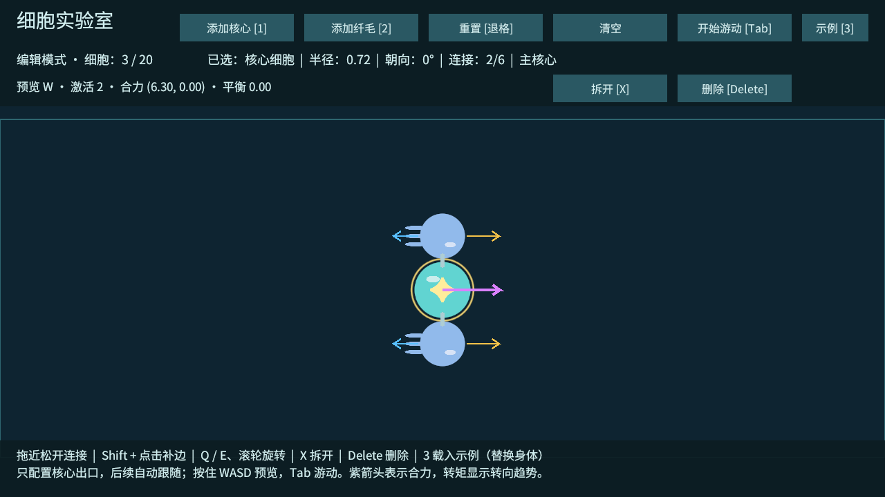
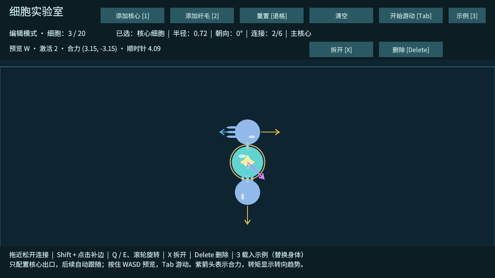

# T07：构筑反馈与 M1 原型验收

2026-10-02，Unity 6000.4.7f1。M1 的身体编辑、核心出口信号、真实施力与规模稳定性完成工程验收。营养、生存、地图和正式美术属于后续阶段。

## 使用新增功能

- 在编辑模式按住 W/A/S/D：预览对应分支。连接桥与橙色箭头变亮，顶部显示激活纤毛数、主动合力和转矩方向，紫色箭头显示合力。
- 预览只计算信号和力，不启动刚体，不移动细胞。按 Tab 进入游动后，相同信号才产生真实运动。
- 选中纤毛可查看收到的通道及最大可达强度，例如 `W 90%`，以及当前预览 / 实际响应。通道仍只在主核心直连出口配置。
- 点击「示例 [3]」或按 3，循环载入直行 → 偏转 → 反向。每个示例都使用一个核心和两个纤毛，默认两个出口为 W。载入会替换当前身体，仅编辑模式可用。

这些示例用于实验室对照，不作为最终游戏的推荐器官配方。紫色箭头显示纤毛主动合力，不是运动轨迹；转矩汇总相对于主核心连通身体的质量中心，不包含阻尼和碰撞力。箭头显示长度有上限，数值以顶部反馈为准。

## 相同细胞数量的对照

使用同一核心（质量 1.4）和两个纤毛（各质量 1、推力 3.5），纤毛分别位于核心正上、正下 1.3 世界单位处。两个核心出口均选 W，每个纤毛收到 90% 强度，单个主动推力为 3.15。仅改变纤毛朝向，不改变数量、质量、初始位置、输入或环境。

每个案例从静止出发，持续 W 共 60 个物理步，时间步长 0.02 秒，即 1.2 秒。分别重复两次。

| 案例 | 上 / 下纤毛朝向 | 预览合力 | 预览转矩 | 核心实际位移 | 核心实际转角 |
| --- | --- | --- | --- | --- | --- |
| 直行 | 180° / 180° | (6.30, 0) | 约 0 | (+0.8763, 0) | 约 0° |
| 偏转 | 180° / 90° | (3.15, -3.15) | -4.095，顺时针 | (+0.3874, -0.4791) | -26.1226° |
| 反向 | 0° / 0° | (-6.30, 0) | 约 0 | (-0.8763, 0) | 约 0° |

两次结果在记录精度内一致。验收限值：直行 / 反向 X 位移绝对值 > 0.1、横向漂移 < 0.02、转角绝对值 < 2°；偏转 X > 0.03、Y < -0.03、顺时针转角超过 5°；重复位移差 < 0.03、转角差 < 3°。验收通过。





## 其他验收

- 预览时输入存在、激活数为 2，但核心位置不变、刚体未模拟、实际受力为 0、物理关节数为 0。
- 不改布局，只把两个核心出口改为 A：W 预览无力，A 预览及实际施力有效。
- 松键后停止主动施力，返回编辑清零线速度和角速度；游动时示例按钮不能替换身体。
- T01～T06 的生成、编辑、拓扑、非法连接、信号传播、分支隔离、环路与基础物理回归通过。
- 20 / 30 细胞的长链、环、对称体六组规模回归通过，合计 402 秒模拟时间、20,100 个物理步。沿用 T05 阈值与刚性连接、速度 / 位置迭代 32 / 16；原生物理计时不代表整个游戏帧率。
- Windows 开发包构建 0 错误、0 警告。M1 ZIP 解压后运行同一验收程序，退出码 0。

证据：[运动数据 JSON](验证数据/T07-运动对照.json)、[功能日志](验证数据/T07-功能验证.txt)、[构建报告](验证数据/T07-构建报告.txt)、[解压包验证日志](验证数据/T07-解压包验证.txt)、[规模 JSON](验证数据/T07-规模回归.json)、[规模 CSV](验证数据/T07-规模回归.csv)。成功标志为 `CELL_LAB_T07_M1_PASS`、`CELL_LAB_T07_PASS` 和 `CELL_STRESS_T05_PASS`。

自动检查通过 Input System 测试设备进入实际输入订阅，不代替真人试玩。VS Code 实际断点命中、其他电脑兼容性仍未验证。运行退出时仍有既有 Unity ComputeBuffer 释放警告，不将构建零警告等同于运行零警告。

## M1 测试包与复现

本机测试包为 `Builds/Emerge-M1-Windows.zip`，解压后运行 `Emerge.exe`，点击游戏窗口后按 3 载入示例，先按 W 预览，再按 Tab 游动。包大小和 SHA256 见 [包说明](验证数据/T07-M1包说明.txt)。

开发包完整功能验收：

```powershell
.\Builds\Windows\Emerge.exe --cell-lab-smoke --cell-lab-screenshot .\Logs\t07-lab.png -logFile .\Logs\t07-player.log
.\Builds\Windows\Emerge.exe --cell-lab-stress -logFile .\Logs\t07-stress.log
```

构建输出不提交 Git，源代码、验证数据和截图提交。下一项为 T08：营养、吸收与代谢。

2026-10-02 补记：用户完成测试并回复“通过”；M1 真人试玩已确认。T08 开发已完成，新增摄食示例与资源限制，操作见 [T08 记录](T08-验证记录.md)。上述 M1 初始包仍作为历史基线保留。
