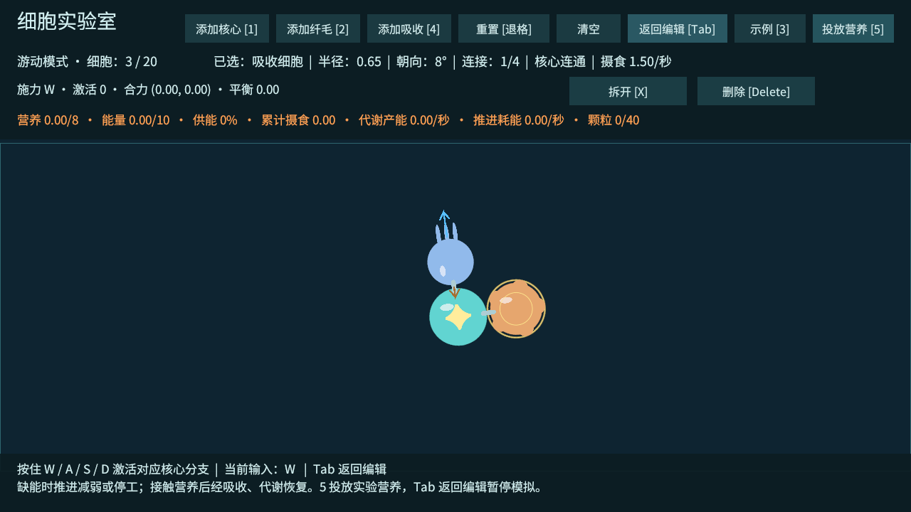
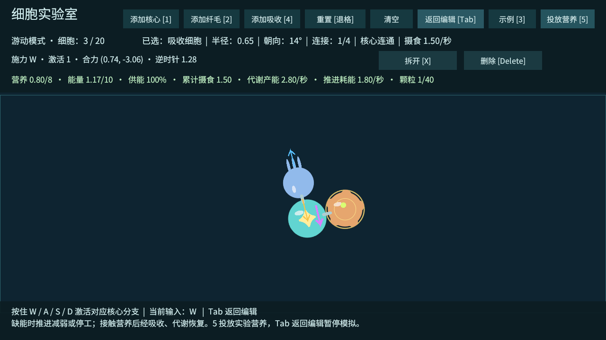

# T08：营养、吸收与能量供应

2026-10-02，Unity 6000.4.7f1。T08 工程验收通过，进入 M2；用户已确认此前 M1 试玩通过。下一项为 T09：纤毛局部流场与定向滤食。

## 现在可以做什么

新增橙色花瓣占位的吸收细胞和黄绿色营养颗粒。与主核心连通的核心、吸收细胞接触颗粒后，将其营养送入共享储备；核心代谢把营养转成能量。纤毛收到信号后还需要能量，缺能时按统一供给比例减弱，耗尽时停止施力，摄食后可以恢复。吸收细胞被动摄食，不需要 WASD 激活，也没有推力。

仍只配置主核心直连出口的 W/A/S/D，后续连接与细胞自动跟随、逐节点衰减。能量供应进一步缩放纤毛响应，不改变信号通道或功能方向。

顶部中文资源栏显示营养、能量、供能比例、累计摄食、当前代谢产能速率、推进耗能速率和颗粒数量。编辑模式暂停摄食、代谢与运动；WASD 只预览当前资源所能支持的力，不扣资源。松开信号后仍有身体维持消耗；耗尽能量不会立即判负，损伤与死亡属于 T11。

## 手动测试流程

1. Unity 打开 `Assets/_Emerge/Scenes/CellLab.unity`，进入 Play，点击 Game 视图取得键盘焦点。也可运行 `Builds/Windows/Emerge.exe`。
2. 从刚启动的编辑模式点击「示例 [3]」四次：直行 → 偏转 → 反向 → 摄食。摄食示例为一个核心、一个纤毛、一个吸收细胞，初始营养 0、能量 1。
3. 先在编辑模式按住 W：资源不减少，身体不移动。按 Tab 游动，继续按 W 约 4 秒：供能下降到 0%，橙色推力箭头消失、纤毛停止推进。身体可能因惯性继续短暂滑动。
4. 保持游动模式和 W，按 5 或点「投放营养」：吸收细胞周围出现颗粒。累计摄食增加、营养转成能量，供能与推进逐渐恢复。默认示例有转矩，因此恢复后会偏转。
5. 松开 W：推进耗能变为 0，仍可接触摄食并代谢；按 Tab 回编辑，资源冻结。返回游动后继续变化。
6. 回编辑选中吸收细胞按 X，按 5：实验投放点改为与核心连通的最佳摄食细胞；断开的吸收细胞不能给主身体供给。重新连接后恢复资格。按 4 可添加吸收细胞。
7. 重置或清空应移除全部颗粒，清零累计摄食并恢复初始资源。

「投放营养」是实验室测试入口，编辑和游动均可使用，上限 40 颗；它不是最终玩法中的免费造食能力。颗粒当前静止，按真实身体位置做圆形接触检测，没有自动吸引或远距离摄食。环境流动和主动滤食留给 T09；温度、损伤、死亡、启动反馈和地图尚未接入。

## 当前参数

这些是可调的原型值，不代表最终平衡。储备按主核心连通身体共享，不模拟逐边资源运输或循环器官。

| 参数 | 当前值 | 数据位置 |
| --- | --- | --- |
| 营养容量 / 默认初值 | 8 / 2 | `Data/Metabolism.asset` |
| 能量容量 / 默认初值 | 10 / 8 | 同上 |
| 核心代谢上限 | 0.7 营养/秒 | 同上 |
| 能量产率 | 每营养产生 4 能量 | 同上 |
| 每个连通细胞维持消耗 | 0.03 能量/秒 | 同上 |
| 纤毛满响应耗能 | 2 能量/秒，按信号强度与供能缩放 | 同上 |
| 平滑供能储备窗口 | 0.35 秒 | 同上 |
| 核心摄食 / 吸收细胞摄食 | 0.08 / 1.5 营养/秒 | `Data/Cells/Core.asset`、`Absorber.asset` |
| 纤毛摄食 | 0 | `Data/Cells/Cilia.asset` |
| 吸收细胞半径 / 质量 | 0.65 / 1 | `Absorber.asset` |
| 普通实验颗粒营养 | 0.4 | 实验投放方法 |
| 颗粒上限 | 40 | `NutrientWorld.Capacity` |

路径相对于 `Assets/_Emerge`。先计算全体纤毛需求、摄食和代谢，再优先支付维持消耗，对所有纤毛使用同一个供能比例；不会让先更新的节点抢光能量。营养满仓时不吃掉额外颗粒，能量满仓时不白白转化营养。只换美术无需改这些数值。

## 实测结果

使用实际 Windows 开发程序与 Input System W 输入。T08 加速检查每步调用正式 `StepActuators` 与 `Physics2D.Simulate`，时间步长 0.02 秒，资源限制开启。

| 检查 | 实测 / 结果 |
| --- | --- |
| 核心单独接触食物，1 秒 | 摄食 0.0800 |
| 吸收细胞单独接触食物，1 秒 | 摄食 1.5000，约为核心 18.75 倍 |
| 无食物、初始能量 1、持续 W 4 秒 | 能量 0、供能 0%、实际推力 0 |
| 每步供能下降 | 最大 0.0591，经过部分供能状态后停工 |
| 缺能后投放接触颗粒、持续 W 1 秒 | 摄食 1.5000；供能 100%；纤毛推力 3.1500；核心位移 0.2994 |
| 两个相同纤毛、仅 0.01 能量 | 响应分别 0.0058571、0.0058571，统一限能 |
| 营养与能量收支 | 最大绝对误差 0.00000216，小于 0.001 阈值 |
| 断开吸收细胞、远处食物、没有核心 | 不摄食；没有核心时不代谢 |
| 编辑暂停、满仓、颗粒上限、重置清理 | 通过 |
| T01～T07 全部功能回归 | 通过，程序退出码 0 |
| 六组 20 / 30 细胞物理回归 | 通过，20,100 步、402 秒模拟；无限能量，专门验证持续驱动物理 |
| 最终 Windows 构建 | 成功，0 错误、0 警告 |

守恒检查为：初始营养 + 摄食 = 当前营养 + 已代谢；初始能量 + 产能 = 当前能量 + 维持消耗 + 活动消耗。压力测试使用无限能量，仅在开发检查中打开并恢复，不作为资源生存或最终游戏帧率的证据。





证据：[代谢 JSON](验证数据/T08-代谢数据.json)、[功能日志](验证数据/T08-功能验证.txt)、[构建报告](验证数据/T08-构建报告.txt)、[规模 JSON](验证数据/T08-规模回归.json)、[规模 CSV](验证数据/T08-规模回归.csv)、[规模日志](验证数据/T08-规模验证.txt)。成功标志：`CELL_LAB_T08_METABOLISM_PASS`、`CELL_LAB_T08_PASS`、`CELL_STRESS_T05_PASS`。

运行退出时仍有既有 Unity ComputeBuffer 释放警告，尚未验证跨机兼容性或 VS Code 真实断点命中。T08 真人数值与手感待试玩，不将自动检查等同于最终平衡。

## 复现自动检查

关闭 Unity 后，用编辑器执行 `Emerge.Editor.CellLabSetup.ConfigureAndBuild`，或在 Unity 菜单构建 Windows Development。新资产与场景引用已保存，无需人工创建。

```powershell
.\Builds\Windows\Emerge.exe --cell-lab-smoke --cell-lab-screenshot .\Logs\t08-lab.png -logFile .\Logs\t08-player.log
.\Builds\Windows\Emerge.exe --cell-lab-stress -logFile .\Logs\t08-stress.log
```

构建与原始日志留在本机；源工程、数据资源、验收记录与截图纳入 Git。

2026-10-02 T09 数值补记：纤毛耗能系数从 2 调为 1.5，局部流场会推动营养颗粒；上述数据保留为 T08 历史基线。T08 缺能、摄食恢复、统一供给与资源守恒在新参数下全部回归通过，见 [T09 代谢回归](验证数据/T09-代谢回归.json)。
