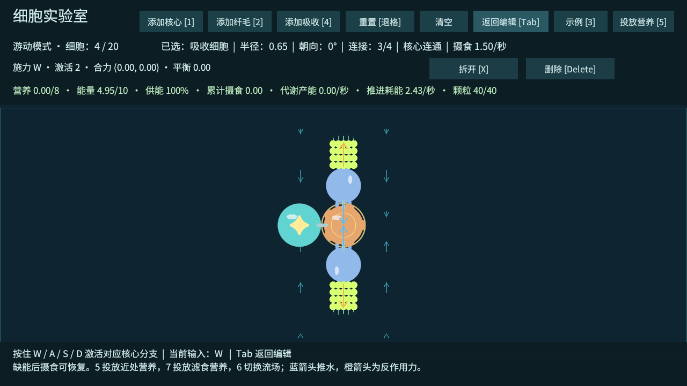
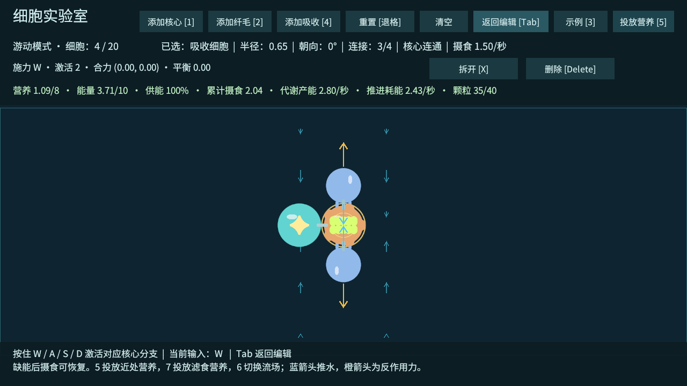

# T09：纤毛局部流场与定向滤食

2026-10-02，Unity 6000.4.7f1。T09 工程验收通过，下一项为 T10：膜阻挡、留存与导流候选。T09 真人手感与最终平衡待试玩。

## 已实现规则

营养颗粒根据当前位置查询流速，并逐物理步移动。局部流速为环境流速加上附近纤毛的贡献，每个纤毛使用自身固定朝向、实际收到的信号和实际供能比例；距离衰减，超出范围没有贡献，总速度有上限。松键、断开主核心或缺能后，纤毛停止产生水流。颗粒没有根据吸收细胞位置寻路、吸附或获得摄食倍率。

摄食仍按真实身体位置与颗粒位置接触判断，营养经过共享储备、核心代谢，再供给纤毛。身体通过原有刚体反作用力运动，不跟随颗粒坐标。编辑模式暂停颗粒、摄食、代谢与身体模拟，只显示可支持的流场预览。

青色小箭头显示采样点流速，颗粒后方短线显示当前流动方向；6 可以隐藏 / 显示采样箭头。蓝色纤毛箭头仍为推水方向，橙色为反作用力。渲染反馈与运动计算独立，可换美术。

## 手动测试流程

1. Unity 打开 `Assets/_Emerge/Scenes/CellLab.unity`，进入 Play，点击 Game 视图。也可运行 `Builds/Windows/Emerge.exe`。
2. 从刚启动的编辑模式按 3 或点击示例五次：直行 → 偏转 → 反向 → 摄食 → 滤食。示例会替换当前身体。
3. 滤食结构为一个核心、一个吸收细胞、两个纤毛。核心连吸收细胞，两个纤毛连吸收细胞；仅核心出口为 W，后续自动继承。两侧纤毛均朝吸收细胞，反作用力抵消。
4. 按 7：在吸收细胞上、下方的接触范围外投放 40 颗营养。先在编辑模式按 W，看到流场预览，但颗粒和资源保持静止。
5. 按 Tab 游动，先不按 W，观察颗粒不进入吸收区、累计摄食为 0。持续 W：两侧颗粒流向中间、进入吸收接触范围、营养和产能增加。几秒后可看到 100% 供能。
6. 松开 W：新增推水立即停止，已有接触范围内的颗粒仍能被动摄食；所以松键后累计摄食可能继续增加。按 Tab 暂停，回编辑后资源和颗粒冻结。
7. 要重做公平对照，退出 Play 再开始，或继续循环示例直到重新载入滤食示例，按 7 重新投放。选中上、下纤毛各旋转 180°，同样 W 游动：它们将营养推出吸收区，无法维持供能。示例缺少食物时会耗尽能量。

5 保留 T08 的近处营养投放，用于缺能恢复；7 是滤食测试投放。实验室投放有 40 颗总量上限，不会自动补充。演示用静止环境与有限食物，不代表无限生存；后续地图提供资源分布与探索压力。

## 参数与数值调整

| 参数 | 当前值 | 位置 |
| --- | --- | --- |
| 纤毛影响半径 | 2.6 世界单位 | `Assets/_Emerge/Data/LocalFlow.asset` |
| 单纤毛满响应流速系数 | 2.6 单位/秒 | 同上 |
| 合成流速上限 | 4 单位/秒 | 同上 |
| 默认环境流速 / 身体环境阻力系数 | (0, 0) / 0 | 同上 |
| 纤毛满响应耗能 | **从 2 改为 1.5 能量/秒** | `Data/Metabolism.asset` |
| 核心代谢上限 / 能量产率 | 0.7 营养/秒 / 4 能量 | 同上，沿用 T08 |
| 吸收速率 | 1.5 营养/秒 | `Data/Cells/Absorber.asset`，沿用 T08 |

代谢最多产能 2.8/秒。滤食纤毛收到第二层信号，各为 0.81，活动需求为 `2 × 0.81 × 1.5 = 2.43`；四细胞维持需求为 `4 × 0.03 = 0.12`，总计 2.55/秒。原耗能系数 2 会使需求 3.36/秒超过代谢上限，即使有营养也无法持续满供能，因此调整原型数值并重跑 T08 缺能、恢复、统一分配与守恒检查。信号保留率、推力和身体质量没有改动。

距离权重为 `1 - 距离平方 / 半径平方`，范围外为 0；不同方向的贡献相加并限制总速度。环境流速可配置；身体环境阻力系数大于 0 时按环境流速与刚体速度之差施力，默认关闭，保持此前运动基线。自动验证覆盖环境颗粒平移，身体环境阻力的玩法与平衡留给地图阶段。

这是一种局部速度近似，不求解完整流体，不保证流体动量守恒。颗粒目前可穿过普通细胞的视觉区域，在实验室边界处限制位置；T10 的膜需要另外实现真实阻挡与留存。旋流、膜导流和第三种结构效果尚未验收。

## 对照与真实收支

同一吸收位置、静止环境、初始营养 0、初始能量 5、40 颗各含 0.4 营养，总量 16。颗粒初始距吸收细胞中心至少约 1.9，接触阈值为 `0.65 + 0.12 = 0.77`。每个案例运行 550 步 × 0.02 秒，即 11 秒；正常案例重复两次。

| 案例 | 摄食量 | 实际产能 | 活动消耗 | 维持消耗 | 最终能量 |
| --- | --- | --- | --- | --- | --- |
| 同样四细胞，不按 W | 0 | 0 | 0 | 1.3200 | 3.6800 |
| 只有核心与吸收，删去两纤毛 | 0 | 0 | 0 | 0.6600 | 4.3399 |
| 同样四细胞，两纤毛反向，按 W | 0 | 0 | 4.6778 | 0.3222 | 0 |
| 朝吸收区推水，按 W，重复 1 | 15.2379 | 29.0079 | 26.7299 | 1.3200 | 5.9579 |
| 朝吸收区推水，按 W，重复 2 | 15.2379 | 29.0079 | 26.7299 | 1.3200 | 5.9579 |

正常案例的摄食全部来自已移动超过 0.1 单位的颗粒，身体漂移小于 0.000001，未用身体移动代替颗粒输送。两次摄食和最终能量在记录精度内一致。

稳定观察窗口为第 3～11 秒：产能 22.3999，活动消耗 19.4399，维持消耗 0.9600，**实际产能超过两项消耗约 2.00 能量，供能全程 100%**。同时有营养储备增长；储备总价值变化按 `能量 + 营养 × 4` 单独记录，不把尚未转化的营养算成已产能。

轨迹示例：颗粒 0 初始距离 1.9268、剩余营养 0.4；0.6 秒距离 0.8728，仍为 0.4；0.8 秒距离 0.6754，营养降到 0.25。它先进入 0.77 接触区，随后才摄食。轨迹按 0.2 秒采样四颗代表性颗粒，完整数值见 CSV。

颗粒总量、营养、能量分别做守恒检查，最大误差 0.00013900，小于 0.003 容差。编辑暂停、缺能无免费流场、断开纤毛、范围限制、速度封顶、重置清理通过。环境流速 (0.3, 0) 下，颗粒 1 秒位移 0.300002；极端环境流速测试被限制为 4。





## 回归与证据

最终 Windows 构建成功，0 错误、0 警告，编译日志没有 C# 警告。T01～T08 与 T09 完整功能检查通过、退出码 0。六组 20 / 30 节点长链、环、对称体物理回归通过，共 20,100 步、402 秒模拟。物理压力测试仍使用无限能量和无营养颗粒，以验证持续驱动；不作为 40 颗粒全场景帧率或正常资源收益的证据。

证据：[滤食对照 JSON](验证数据/T09-滤食对照.json)、[颗粒轨迹 CSV](验证数据/T09-颗粒轨迹.csv)、[功能日志](验证数据/T09-功能验证.txt)、[代谢回归 JSON](验证数据/T09-代谢回归.json)、[构建报告](验证数据/T09-构建报告.txt)、[规模 JSON](验证数据/T09-规模回归.json)、[规模 CSV](验证数据/T09-规模回归.csv)、[规模日志](验证数据/T09-规模验证.txt)。成功标志 `CELL_LAB_T09_FLOW_PASS`、`CELL_LAB_T09_PASS`、`CELL_STRESS_T05_PASS`。

自动检查每步调用正式 `StepActuators` 与 `Physics2D.Simulate`，使用真实 Input System 测试输入，并保存显式渲染截图。运行退出仍有既有 Unity ComputeBuffer 释放警告；跨机、真实断点命中和 T09 真人试玩未验证。

复现：

```powershell
.\Builds\Windows\Emerge.exe --cell-lab-smoke --cell-lab-screenshot .\Logs\t09-lab.png -logFile .\Logs\t09-player.log
.\Builds\Windows\Emerge.exe --cell-lab-stress -logFile .\Logs\t09-stress.log
```

源工程、参数、截图与证据纳入 Git；构建输出和原始日志留在本机。

2026-10-03 后续变更：吸收规则已改为先捕获、胃内逐渐消化；本文数值保留为该阶段版本的历史记录。现版本试玩和回归结果见 [吸收优化与 T12](吸收优化与T12-收缩验证.md)，界面现区分捕获 / 消化。
