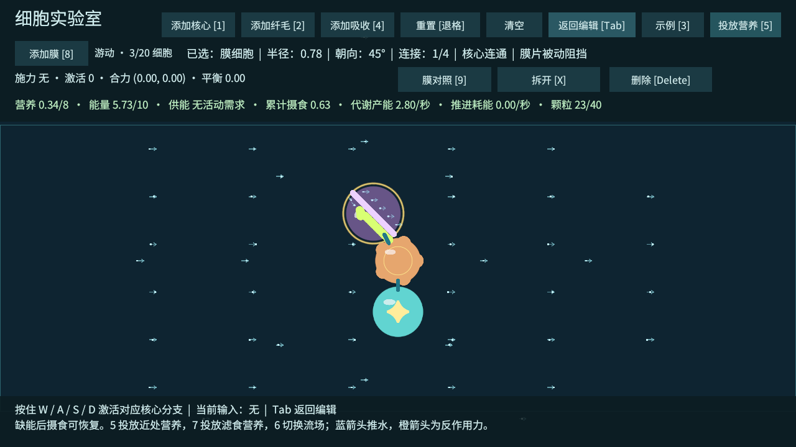
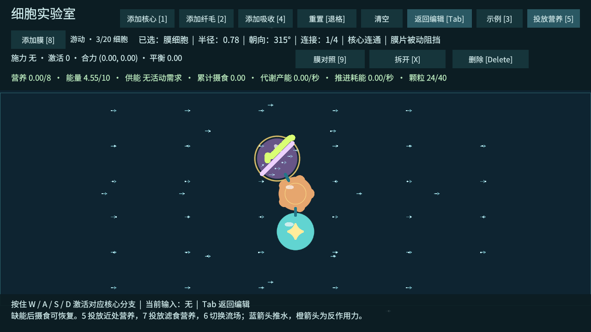

# T10：膜阻挡、留存与导流

2026-10-03。工程验收完成，真人试玩待确认；下一项为 T11 温度、损伤与核心死亡。

## 试玩流程

打开 `Assets/_Emerge/Scenes/CellLab.unity`，进入 Play，点击 Game 画面。

1. 按 **9**（或点击「膜对照」）载入正确朝向的膜导流示例。营养、水流和身体会自动准备好。
2. 按 **Tab** 开始游动，**无需 WASD**。这项对照使用固定环境水流，避免身体推进干扰颗粒轨迹。
3. 观察绿色颗粒从左向右运动，碰到白色斜膜后沿膜向右下方滑动，进入橙色吸收细胞；顶部「累计摄食」随实际接触增长。观察约 13 秒。
4. 按 **Tab** 返回编辑，再按 **9** 载入无膜对照；再次 Tab，观察同样时长，颗粒从吸收细胞上方经过，摄食保持 0。
5. 再次 Tab → 9 → Tab，进入错误朝向对照，颗粒被引到上方，摄食保持 0。
6. 再次载入正确案例后，可在编辑模式选中膜，Q/E 或滚轮旋转，观察方向改变如何影响轨迹。按 **6** 隐藏 / 显示水流，不影响模拟。

3 的示例循环保留原有五种，在第六项加入膜导流。8 或「添加膜」按钮可以添加膜细胞，拖拽连接、Shift 补边、拆开、删除及容量限制与其他细胞一致。返回编辑会暂停颗粒、摄食与代谢；重置、清空或载入其他示例会移除膜对照专用水流。每次对照重新投放相同营养，营养不自动补充。

对照场景应关闭自己添加的 FlowRegion / 营养放置对象以及默认关闭的「场景环境示例」，避免其他水流改变试验条件。普通模式仍支持场景放置对象与纤毛共同生成水流。

## 规则与资产

- 膜是被动细胞，无需输入，吸收率与推进力均为 0；连通后计入正常维持成本，信号仍按统一保留率传递。断开核心后，实体膜仍能阻挡，不能凭断路变成透明物体。
- 膜面沿局部 Y，半长等于细胞半径 0.78；厚度 0.16。白色条与圆端表示真实阻挡表面，紫色圆体表示用于连接和身体碰撞的细胞。
- 颗粒半径 0.12，输运使用扩张后的有限胶囊面；整段位移检查最早接触，移除朝向膜内的剩余位移，保留切向位移。颗粒能沿膜滑动并绕过有限端点。拐角使用有限次迭代，未解决的残余位移停止，避免穿透。
- 流向查询在接触表面去掉朝膜内的速度；膜两侧增加流向采样。颗粒尾线显示约束后的实际位移速度。纤毛原有固定方向、信号衰减和能量约束不变。
- 摄食继续按吸收细胞的实际接触距离和每秒预算计算，没有吸收倍率、额外奖励或自动吸附。

配置资产：`Assets/_Emerge/Data/Cells/Membrane.asset`。可替换美术预制体：`Assets/_Emerge/Prefabs/Cells/MembraneCell.prefab`，其 Body、白色条、圆端均为独立 SpriteRenderer；保留 CellView 的引用与功能方向。占位条纹 `MembraneStrip.png` 由编辑配置首次生成，后续已有预制体与美术替换会保留。

这是局部颗粒输运约束，不是完整流体求解。膜不重算远处压力或尾流、不从水体获得反作用力；身体仍使用现有圆形碰撞体和刚性连接。移动膜使用当步刚体位置处理相交，尚未验证高速移动膜面的连续扫掠。热交换与损伤属于 T11；封闭囊袋的主动抽排属于后续候选。

## 工程验收

条件：Unity 6000.4.7f1，固定步长约 0.02 秒，650 步 / 13 秒；固定环境水流向右 0.8 世界单位 / 秒；核心和吸收细胞位置固定，吸收率 1.5 / 秒；24 颗、每颗 0.4，总营养 9.6；初始营养 0、能量 5。未启用无限能量，没有纤毛活动成本。

| 布局 | 摄食 | 剩余颗粒营养 | 维持耗能 | 最终能量 | 最终体内营养 |
| --- | ---: | ---: | ---: | ---: | ---: |
| 正确朝向，第一次 | 5.1600 | 4.4400 | 1.1700 | 9.9982 | 3.6180 |
| 无膜 | 0 | 9.6000 | 0.7800 | 4.2199 | 0 |
| 错误朝向 | 0 | 9.6000 | 1.1700 | 3.8300 | 0 |
| 正确朝向，第二次 | 5.1600 | 4.4400 | 1.1700 | 9.9982 | 3.6180 |

正确和错误朝向具有相同的三个细胞，只改变膜朝向；无膜基线为两个细胞，所以维持耗能较低。摄食差来自颗粒路径。正确案例发生 199 次扫掠接触；轨迹采样中最小膜面距离 0.200025，大于膜半厚与颗粒半径之和 0.2；最大资源账本误差低于 0.00013，身体漂移低于 0.000001。正确布局重复结果一致。

另已验证：单步 20 单位位移被膜两面阻挡、膜端外通行、移动或旋转改变阻挡位置、断开核心仍阻挡；三膜开口留存结构在 500 步持续来流下停留，旋转前壁后释放。留存检查为输运几何试验，不宣称已完成可试玩的捕食袋或泵。

最终 Windows 开发包构建 0 错误、0 警告，完整 T01～T10 功能检查与六组 20 / 30 细胞物理压力回归通过，两个独立测试进程均正常退出码 0。规模回归使用原有核心 / 纤毛结构、无限能量与无营养条件，不代表混合膜结构的整体帧率。退出时仍有既有 Unity ComputeBuffer 释放警告。

证据：[T10 JSON](验证数据/T10-膜验证.json)、[颗粒轨迹 CSV](验证数据/T10-颗粒轨迹.csv)、[完整功能日志](验证数据/T10-功能验证.txt)、[构建报告](验证数据/T10-构建报告.txt)、[规模 JSON](验证数据/T10-规模验证.json)、[规模日志](验证数据/T10-规模验证.txt)。成功标志为 `CELL_LAB_T10_MEMBRANE_PASS` 与 `CELL_LAB_T10_PASS`。

