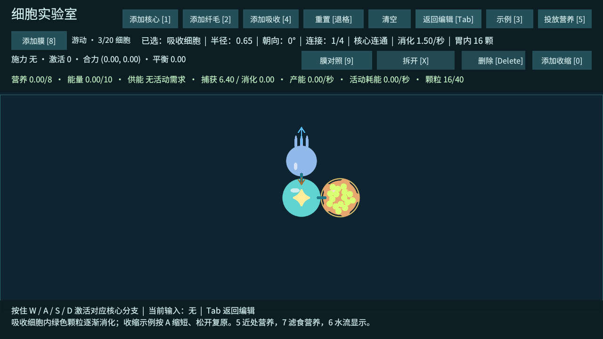
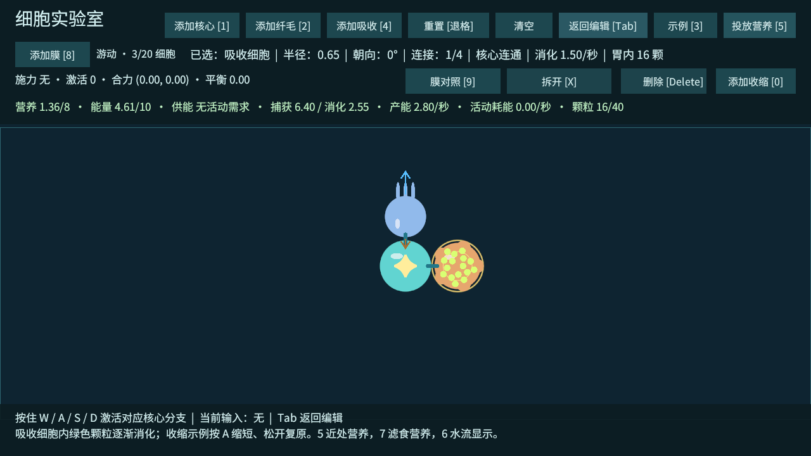
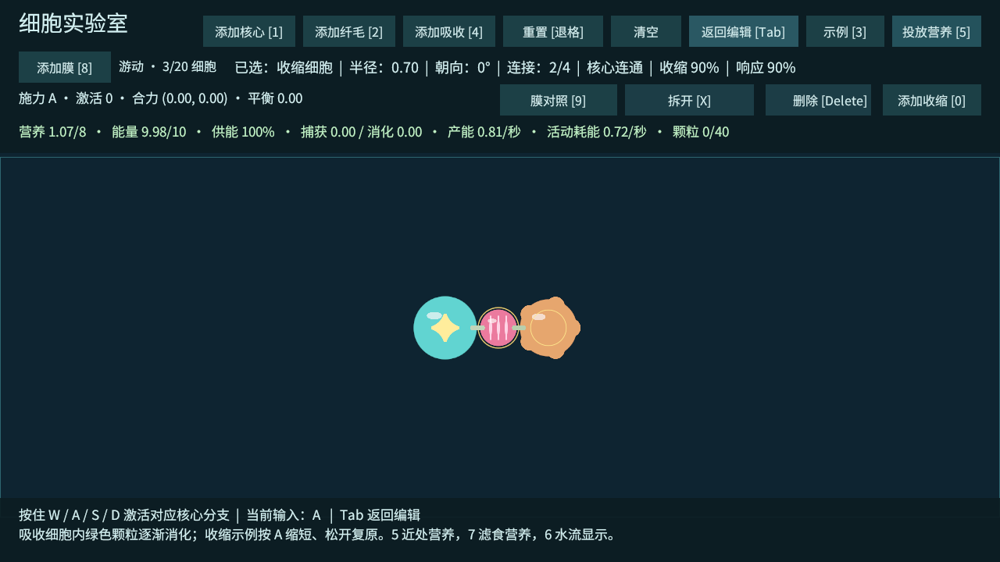

# 吸收优化与 T12 收缩细胞

2026-10-03。按用户要求，先优化吸收，再提前完成 T12 收缩原型；T11 温度、损伤与核心死亡顺延，仍为下一项。工程验证完成，真人试玩待确认。

## 吸收试玩

打开 CellLab，进入 Play 并点击 Game 画面。按 3 四次载入摄食示例，按 5 投放近处营养，按 Tab 游动。橙色吸收细胞会把食物兜进体内，绿色颗粒随身体移动并一起逐渐缩小；顶部区分「捕获」和「消化」，选中吸收细胞可看到胃内颗数。松开 WASD 后仍能观察被动捕获与消化。再次 Tab 暂停，颗粒及消化进度冻结。

也可以用 9 的膜导流或 3 的滤食示例观察远处营养进入吸收细胞后被留住。食物一旦被捕获，不再受环境水流推动；纤毛停止推水后，胃内食物仍逐渐消化。

规则：完整颗粒通过实际接触被捕获，捕获当步不提供营养或能量；先等待至少 0.3 秒，然后多颗食物分摊吸收细胞每秒 1.5 的总消化预算。消化量进入共享营养储备，再由核心原有代谢转化为能量。颗粒剩余量和可见大小同步减少，完全消化后才移除。

默认胃容量 8 营养单位、16 个颗粒槽；容量不足时不强行吞下整颗食物。胃内颗粒也计入全场 40 颗上限。共享营养储备满时暂停消化，食物不会被删除；释放储备空间后继续。吸收细胞必须与主核心连通才捕获及消化，断路时已有食物保留但停止向身体提供营养；删除吸收细胞会把未消化颗粒释放到世界，清空 / 重置则按实验室规则清理全部食物。

专用吸收细胞优先捕获，避免核心弱吸收抢先处理同一颗食物。核心保留原有弱吸收作为起步兜底。胃内容物目前是可见的独立颗粒与逻辑容量，不是需要手动构筑的囊袋碰撞体。

## 收缩试玩

1. 返回编辑，按 **C** 载入收缩示例：核心—收缩—吸收。
2. 按 **Tab** 游动，再按住 **A**。粉色条纹细胞缩小，两侧细胞被真实关节拉近。
3. 松开 A，逐渐回到原长；此示例 W 不响应，因为核心出口配置为 A。
4. 收缩过程中 Tab 返回编辑，保持当前形态并暂停；重新游动后松键复原。
5. **0** 或「添加收缩」按钮添加收缩细胞。自行搭建时，输入仍取决于核心出口配置，默认出口为 W；收缩细胞不单独选择 WASD。3 的第七个示例也能载入收缩案例。

收缩细胞被激活时缩短自身所有相邻连接，目标由信号衰减和实际供能决定；没有信号或缺能时被动复原。普通连接继续使用刚性关节，涉及收缩细胞的连接使用中心到中心的距离关节，允许转动。细胞半径随收缩减小，让邻居能接近而不靠强行重叠；恢复时碰撞体、连接长度和视觉一起恢复。编辑时点击、连接、拖动和边界判断使用当前尺寸。

收缩成本为满响应每秒 0.8 能量，按响应强度扣除，与纤毛共用统一供能比例；保持收缩也耗能。恢复视为被动回弹。收缩改变实际几何与局部节点运动，不给整个共生体添加平移推力，未宣称独立推进、喷流或腔体泵已成立。

## 配置与美术替换

`Data/Cells/Absorber.asset` 的 Food Capacity、Food Slots、Digestion Delay、Absorption Rate 分别控制胃容量、颗粒槽、消化等待和总消化速率。身体能量 / 营养容量仍在 `Data/Metabolism.asset`。

`Data/Cells/Contractor.asset` 管理收缩细胞半径、信号保留率、Contracted Size（满响应最小尺寸比，默认 0.55）和 Contraction Speed（响应变化速率，默认每秒 1）。`MetabolismSettings.contractionCost` 默认 0.8。

`Prefabs/Cells/AbsorberCell.prefab`、`ContractorCell.prefab` 与 `Prefabs/World/Nutrient.prefab` 均可替换美术。保留根 CellView / NutrientParticle 和 Body、Selection、Visual 引用，修改视觉子对象；颗粒胃内定位不依赖具体 Sprite。收缩根尺度由玩法控制，不用它修正美术尺寸。

## 验证范围

捕获当步食物量不减少，胃内颗粒随身体移动、旋转且不被水流吹走；单颗 2 单位食物在第一秒约消化 1.02，余量仍在胃内。已检查延迟、容量、满储备暂停、断路暂停、删除释放、编辑暂停、资源守恒与清理。

核心出口 A 的收缩响应为 90%，示例跨度 2.77 → 2.203 → 2.77，核心节点真实位移约 0.2501；整体质心漂移约 0.0000006，没有直接推进力。2 秒按住消耗活动能量 1.44；错误通道、零能量停止、短缺比例响应、断路、暂停与恢复通过。

20 / 30 节点混合收缩—纤毛—吸收长链，各模拟 60 秒、30 轮按住 / 松开，共 60 轮；距离误差和速度在预设 0.25 / 16 阈值内，未出现非有限坐标。仅该物理压力部分启用无限能量，避免缺能掩盖持续驱动风险；正常玩法及前面的资源验证仍受真实供能约束。保留原有六组长链、环和对称体压力回归；尚未覆盖收缩环路、所有混合结构或全场帧率，相关复杂布局需再验证。

Windows 开发包构建零错误、零警告。完整 T01～T10 回归以及本次吸收 / T12 验证通过；旧 T08 接触即摄食的断言改为延迟消化，不把旧数值当作现版本结果。滤食仍需覆盖真实活动成本，膜对照仍要求无膜 / 错误朝向为 0、正确布局可重复。新结果见随附 JSON；旧记录作为当时版本的历史证据保留。退出时仍有既有 Unity ComputeBuffer 释放警告。

证据：[吸收与收缩 JSON](验证数据/吸收收缩-结果.json)、[完整功能日志](验证数据/吸收收缩-功能验证.txt)、[构建报告](验证数据/吸收收缩-构建报告.txt)、[滤食新结果](验证数据/吸收收缩-滤食结果.json)、[膜新结果](验证数据/吸收收缩-膜结果.json)、[原有规模回归](验证数据/吸收收缩-规模结果.json)。

