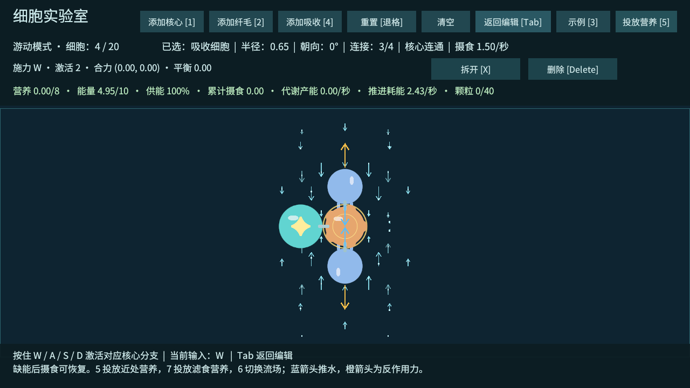
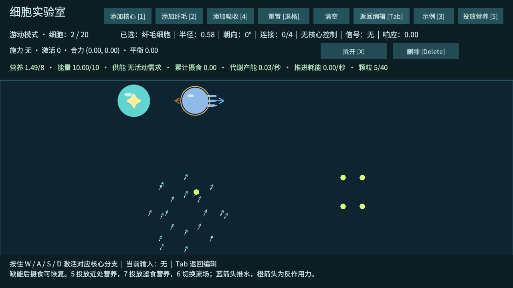

# 场景流场、营养放置与纤毛周围水流

2026-10-02，T09 的场景编辑补充。已实现可放置的环境流场、营养区域、单颗营养放置点，以及围绕活跃纤毛的密集局部水流显示。下一项仍为 T10 膜协同。

## 放置对象

先退出 Play，打开 `Assets/_Emerge/Scenes/CellLab.unity`。Project 面板打开 `Assets/_Emerge/Prefabs/World`，将预制体拖入 Hierarchy 或 Scene 视图；也可用上方 `GameObject > Emerge` 菜单创建。

| 预制体 | 用途 | Inspector 参数 |
| --- | --- | --- |
| `FlowRegion.prefab` | 指定位置的环境流场 | Transform Position、Rotation Z；Radius 半径、Speed 速度、Fade At Edge 边缘衰减 |
| `NutrientPatch.prefab` | 指定区域的一批营养 | Transform 位置、旋转、缩放；Count 数量、Amount 每颗营养、Size 区域宽高 |
| `NutrientPoint.prefab` | 指定位置的单颗营养 | Transform Position；Count 默认为 1，Amount 每颗营养 |

例如：把流场放在 `(0, -1, 0)`，Radius 设为 2、Speed 设为 0.6，Rotation Z = 0 向右，90 向上，180 向左。把营养放置点放在流场附近，Play 后 Tab 游动，就能看到颗粒在范围内被水流推动。

勾选 Scene 视图的 Gizmos，可以看到蓝色流场边界和方向，以及绿色营养初始位置。流场 Radius 使用世界单位，请用 Radius 调整范围；对象旋转决定局部 +X 流向，Transform 缩放不改变它的流速和半径。营养区域的 Transform 缩放和旋转会改变网格布局。

放置点是生成标记，运行时颗粒由 NutrientWorld 管理。用于场景摆放的是 `NutrientPoint` / `NutrientPatch`；已有 `Nutrient.prefab` 是实际颗粒的内部模板，请不要把它当作放置标记。

## 现成场景示例

CellLab 的 Hierarchy 中已增加 **「场景环境示例（启用后投放）」**，默认关闭。选中它，在 Inspector 顶部勾选启用，再 Play：左侧 `(-6, -1)` 附近的环境流场会推动初始营养。可以展开父对象，移动或旋转子对象，调整参数后保存场景。

默认关闭是为了让原有直行、偏转、摄食、滤食实验保持原来的初始条件。做指定位置的场景测试时，启用示例或自己拖入预制体即可。实验室可见模拟区域约为 X `-10.6～10.6`、Y `-5～2.6`；将放置点放在范围内，Z 保持 0。

营养区域进入 Play 时生成一次；Backspace 重置或载入新示例时恢复初始位置和数量。Tab 切换编辑 / 游动不会再生成。清空会移除当前颗粒，随后重置可恢复。运行时关闭营养区域不会删除它已经生成的食物；再次启用不会重复赠送营养，需要重置来恢复。营养没有自动补充。

营养区域和 5 / 7 手动投放共用总上限 40 颗；多个区域总量超过上限时，仅生成剩余预算允许的颗粒。场景放置功能用于搭建环境与实验，不是玩家编辑身体时的免费造食能力。

## 纤毛周围的水流

每个激活纤毛周围新增两圈各 8 个采样点，加上原有场景采样，显示青色流向箭头。亮点沿箭头流动，便于看清方向；长度随查询流速变化。采样跟随纤毛的实际位置，显示**环境流场与附近所有纤毛合成后的水流**，不是简单复制该纤毛自己的箭头。

蓝色长箭头仍表示纤毛自身推水方向，橙色为身体反作用力。相邻纤毛的贡献抵消或叠加时，周围水流箭头可能与单个纤毛方向不同，这是实际查询结果。

刚启动后按 3 五次进入滤食示例，按住 W 在编辑模式预览；Tab 游动后实际推水。按 6 隐藏 / 显示水流可视化，不影响模拟。松键、失去主核心信号或缺能后，该纤毛不再增加局部水流；如果同一位置还有环境流或其他纤毛贡献，那里仍可能显示水流。

流动亮点是方向提示，真实营养运动仍使用相同流速查询。编辑模式的亮点表示预览，营养与资源保持暂停。新反馈用一个合并网格绘制，避免为每个局部箭头创建单独对象。

## 验证

Windows 开发包构建成功，0 错误、0 警告，C# 编译无警告。完整功能检查与六组 20 / 30 细胞物理回归通过，程序退出码 0。

- 指定中心产生流场，范围外不受影响；对象旋转和移动会改变流向与位置，两个区域贡献正确合成，禁用后停止贡献。
- 四颗旋转网格营养与一颗指定点营养，共生成 5 颗，含量和位置符合配置；禁用再启用不重复生成。
- 合成流速 `(0.5, 1)` 下，指定点颗粒 1 秒位移约 `(0.500000, 0.999999)`。
- 重置恢复 5 颗及每个初始位置；清空移除全部颗粒。
- 滤食示例显示 32 个纤毛周围采样箭头；合并网格 704 个顶点。显式渲染截图已检查。
- 隐藏可视化不改变查询流速；松键后局部采样清零。
- T01～T09 的信号、物理、资源守恒、缺能恢复与滤食正收益回归通过。规模回归依旧使用无限能量、无营养颗粒，仅证明持续驱动物理稳定性。

证据：[对象验证 JSON](验证数据/场景环境-对象验证.json)、[完整功能日志](验证数据/场景环境-功能验证.txt)、[构建报告](验证数据/场景环境-构建报告.txt)、[规模 JSON](验证数据/场景环境-规模回归.json)、[规模日志](验证数据/场景环境-规模验证.txt)。新成功标志为 `CELL_LAB_SCENE_ENVIRONMENT_PASS`。

退出时仍有既有 Unity ComputeBuffer 释放警告。跨机和真人场景摆放体验待确认。
