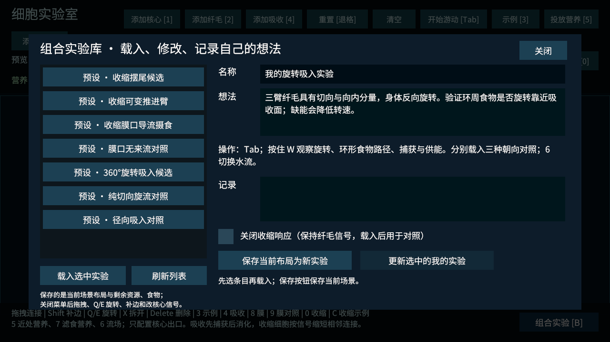
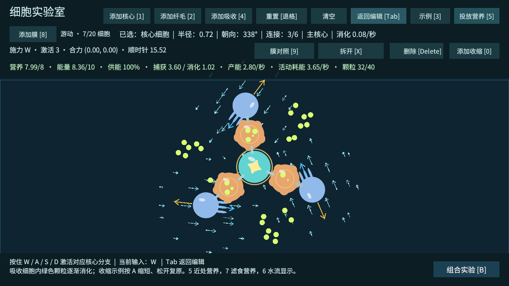

# 组合实验库与测试指南

日期：2026-10-03。用途：试验细胞组合、保存想法和布局。当前仍是原型实验室，T11 生存压力与 T13 完整 M2 验收另行完成。

## 从这里开始

1. 用 Unity 打开 `Assets/_Emerge/Scenes/CellLab.unity`，点击 Play，再点击 Game 窗口。
2. 点击右下角 **组合实验 [B]**，或按 B。菜单会自动返回编辑模式，暂停模拟。
3. 左侧选择一个预设，右侧阅读想法与操作，点击 **载入选中实验**。载入会替换当前身体和食物，先保存自己的布局。
4. 按 Tab 开始游动，再按预设指定的 W/A。按 6 开关局部流向。观察身体、颗粒路径，以及顶部的捕获、消化、供能。
5. 再按 Tab 暂停，或直接打开实验菜单。可以在“记录”中填写结果，并保存当前布局。
6. 每次比较先重新载入，或在编辑模式按退格。退格恢复最近载入的实验条件；想使用刚保存的布局，重新载入自己的实验。清空会退出当前实验。

打开菜单时暂停物理，不会自动恢复游动；关菜单后按 Tab 继续。输入框里的字母不会触发添加、删除、旋转或模式切换。

## 七组布局

| 预设 | 结构与输入 | 重点观察 |
| --- | --- | --- |
| 收缩摆尾候选 | 核心直连纤毛 W；收缩臂和末端纤毛 A；W 常按，A 按 1 秒松 1 秒 | 两条分支共同驱动的姿态、轨迹、收缩代价；不把内部收缩直接当作额外推力 |
| 收缩可变推进臂 | 两侧收缩臂携带同向纤毛，另有侧面吸收；按 W | 臂长与推进轨迹，末端关节可转动；同样输入是否有收益 |
| 收缩膜口导流摄食 | 吸收两侧接收缩与斜膜；固定向下环境来流；A 按 1 秒松 1 秒 | 开口变化、导流、胃内留存和消化；与冻结收缩比较 |
| 膜口无来流对照 | 相同身体和食物，删除环境来流 | 收缩动作是否能自行输送外部食物；目前不计算收缩水压 |
| 360°旋转吸入候选 | 三臂吸收＋纤毛，纤毛朝向为该臂外向角＋135°；32 颗食物环周布置；按 W | 切向和向内分量共同输送，身体反向旋转，是否覆盖环周食物 |
| 纯切向旋流对照 | 同样位置，纤毛朝向为外向角＋90°；按 W | 能旋转是否就能吸入？ |
| 径向吸入对照 | 同样位置，纤毛朝向为外向角＋180°；按 W | 不依赖旋转时的覆盖与摄食量 |

每个核心出口只配置一种 W/A/S/D 信号；后续细胞和连接自动继承，并按节点衰减。旋转预设为三条 W 分支，吸收后面的纤毛收到强度约 0.81。没有添加每个纤毛单独的 WASD，也没有增加旋转吸食的额外奖励或全局吸引力。

移动预设初始营养 8、能量 10，摄食预设使用对应数据中的资源和有限食物；仍然真实耗能，不是无限能量展示。长期供能见顶部，不能拿不同供能下的位移直接判断纯机械效率。

## 修改和保存自己的想法

关闭菜单后在编辑模式调整：拖拽移动连接整体、Shift 点击接触细胞补边、X 拆开、Delete 删除、Q/E 或滚轮改朝向；1/2/4/8/0 分别添加核心、纤毛、吸收、膜和收缩。点击核心直连连接桥改变出口信号。

想改变已连接身体的相对形状，先拆开相应部分，移动后在圆周接触位置重新连接。改食物位置可使用下面的实验资产 Inspector；运行时也可用 5/7 投放新颗粒再保存。

打开实验库填写 **名称、想法、记录**，点击 **保存当前布局为新实验**。左侧会出现“我的”条目；重新载入后继续调整，点击 **更新选中的我的实验** 替换自己的条目。预设不能通过更新按钮覆盖，先另存为副本。更新按钮保存的是当前场景，不是左侧条目仅被选中时的旧布局。

“关闭收缩响应”用于对照：打开原实验，勾选后载入，采用相同的键盘输入，纤毛信号继续传播，收缩响应和收缩活动耗能关闭。这样比较的是整个收缩功能开关，包含几何和耗能的变化。该勾选也可保存到自己的实验中；取消后重新载入恢复。不要用两次已消耗不同资源的场景直接比较。

保存包含：细胞类型、位置、朝向、当前收缩程度，连接与核心出口，剩余自由/胃内食物，资源、局部环境流场、全局来流，以及文字记录。它保存可重新开始的实验条件；不会延续速度、旧的累计统计或胃内消化计时，载入后食物重新等待消化延迟。保存要求仅有一个核心、最多 30 个细胞和 40 颗食物，不重叠、不出界、连接在圆周接触处；不合法配置会提示，载入前验证，不清空当前身体。

Unity Play 中保存到 `emerge/UserData/Experiments/*.json`，退出 Play 和重新启动后仍在。独立 Windows 游戏保存到 `Application.persistentDataPath/Experiments`，两者目录独立。Unity 中的 JSON 可随项目提交 Git；不要误删 `UserData`。每份新实验以唯一文件名存放，同名标题可以并存。

## 在 Unity 菜单中创建和精确编辑

Unity 顶部 **Emerge → 组合实验 → 打开实验库**，浏览资产、复制预设、编辑 Inspector 数据；**Emerge → 组合实验 → 创建我的实验** 创建一个只有核心的起点。也可在 Project 右键 **Create → Emerge → 组合实验**。

七个预设位于 `Assets/_Emerge/Data/Experiments/`。修改已有资产后配置脚本会保留改动。`Cells` 是细胞列表，`Links` 的 a/b 是从 0 开始的细胞索引；`Food` 的 captor=-1 表示外部颗粒，其他值为吸收细胞索引；`Flows` 的 rotation 改局部 +X 流向，speed/radius 改速度和半径。位置使用世界坐标。

创建或复制资产后，退出 Play，在实验库窗口点击 **将实验资产加入当前场景菜单（非 Play）**，Ctrl+S 保存场景。下次 Play 和构建会包含这些资产。窗口也可在 Play 时直接载入所选资产。JSON“我的实验”属于运行时保存，不会自动转换为 `.asset`。

载入组合实验后，场景原有环境流场、全局来流与营养放置区域暂不参与；只使用实验保存的环境。清空后恢复普通场景环境规则，重置普通实验室会恢复场景营养。这样比较不同身体时无需先清理自己放置的环境对象。

## 验证和边界

工程验证包括预设合法性、十组 20 秒实验、资源守恒、收缩关闭不改变纤毛信号、保存后重读并更新、胃内食物/收缩/流场还原、非法数据保留原身体，以及原有 T01～T10 和胃内消化/T12 回归。结果见 `验证数据/组合实验-results.json`。

20 秒有限资源实测，W 持续，A 每 1 秒按/松切换。位移为身体质心位移，角度为核心累积旋转；移动样本可能接近边界，不将其当作无限空间效率。摄食不等于捕获：核心保留弱即时摄食，径向对照的一部分消化来自核心。

| 结构 | 捕获营养 / 颗数 | 消化营养 | 累积旋转 | 质心位移 | 活动耗能 |
| --- | --- | --- | --- | --- | --- |
| 摆尾开启收缩 | 0 / 0 | 0 | -102.76° | 2.616 | 39.378 |
| 摆尾关闭收缩 | 0 / 0 | 0 | -108.29° | 2.571 | 38.895 |
| 推进臂开启收缩 | 0 / 0 | 0 | 0.33° | 7.292 | 39.771 |
| 推进臂关闭收缩 | 0 / 0 | 0 | -0.01° | 9.087 | 38.995 |
| 收缩膜口＋来流 | 8 / 20 | 8.000 | -0.03° | 约 0 | 12.960 |
| 静态膜口＋来流 | 8 / 20 | 7.398 | 约 0° | 0 | 0 |
| 收缩膜口，无来流 | 0 / 0 | 0 | -0.03° | 约 0 | 12.542 |
| 旋转吸入 | 12.8 / 32 | 12.800 | -423.99° | 约 0 | 60.889 |
| 纯切向 | 0 / 0 | 0 | -401.14° | 约 0 | 39.411 |
| 纯径向 | 3.2 / 8 | 4.432 | 约 0° | 约 0 | 55.491 |

旋转吸入在这一布置中覆盖了完整环周；纯切向只旋转没有捕获。收缩膜口与静态膜口捕获一样多，收缩版本多消化的 0.602 是额外活动耗能释放了营养池空间，不能当作免费提升。可变推进臂也没有证明收缩有优势；摆尾轨迹略有不同但供能和成本同时改变。先保留候选，后续优先改膜口食物布置、开口尺寸和脉冲时机，而非给收缩加人为摄食奖励。

最大资源守恒误差约 0.000565；旋转吸入 20 秒结束时能量 0.855、营养 6.814，最低供能约 71%。这一段有限食物实验不证明能无限持续，持续生存与温度仍属于 T11/T13。

这里的局部水流由纤毛叠加和膜面约束近似构成，不是完整流体或负压模拟。旋转吸入成立表示这些规则下的环周食物覆盖成立；收缩膜口能摄食不自动证明收缩比静态膜更好。正式评估需要相同初始条件的多次人工试玩和资源成本比较。

## 画面参考

